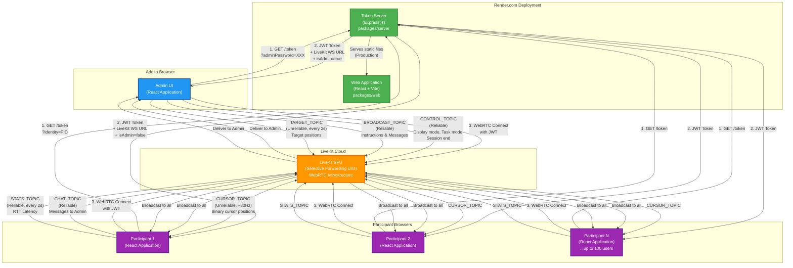
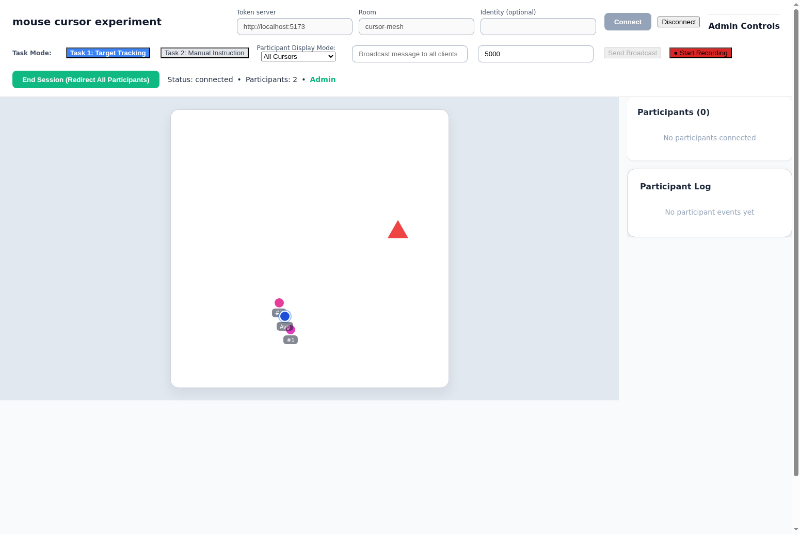
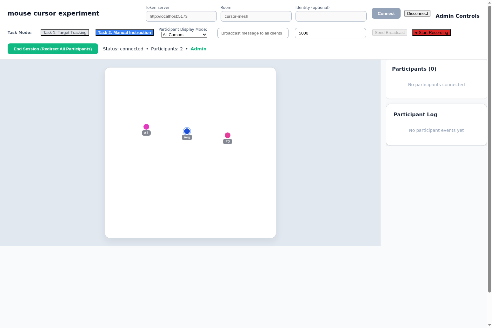
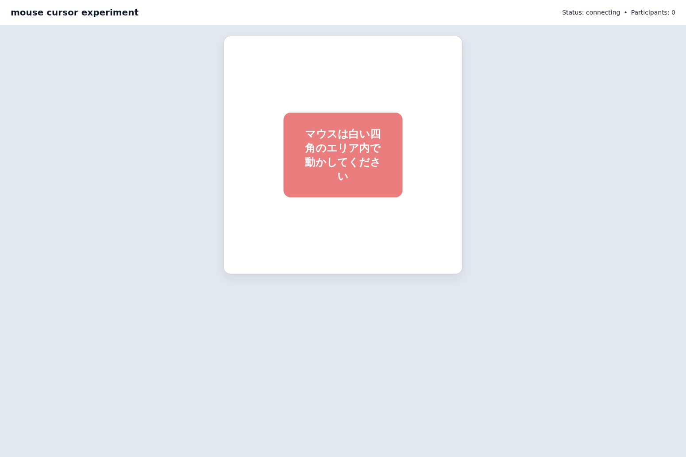
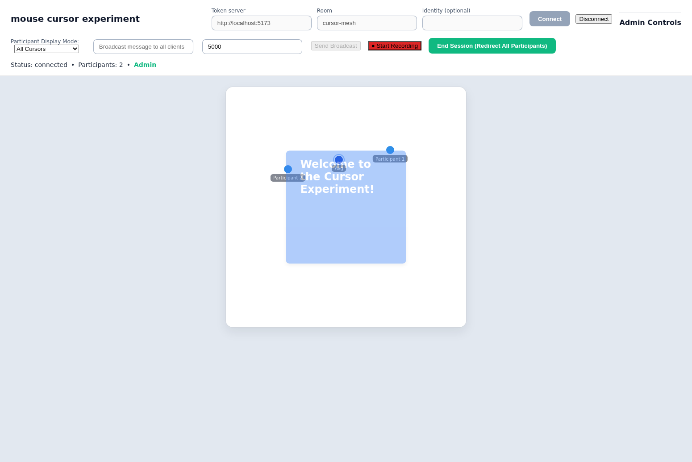
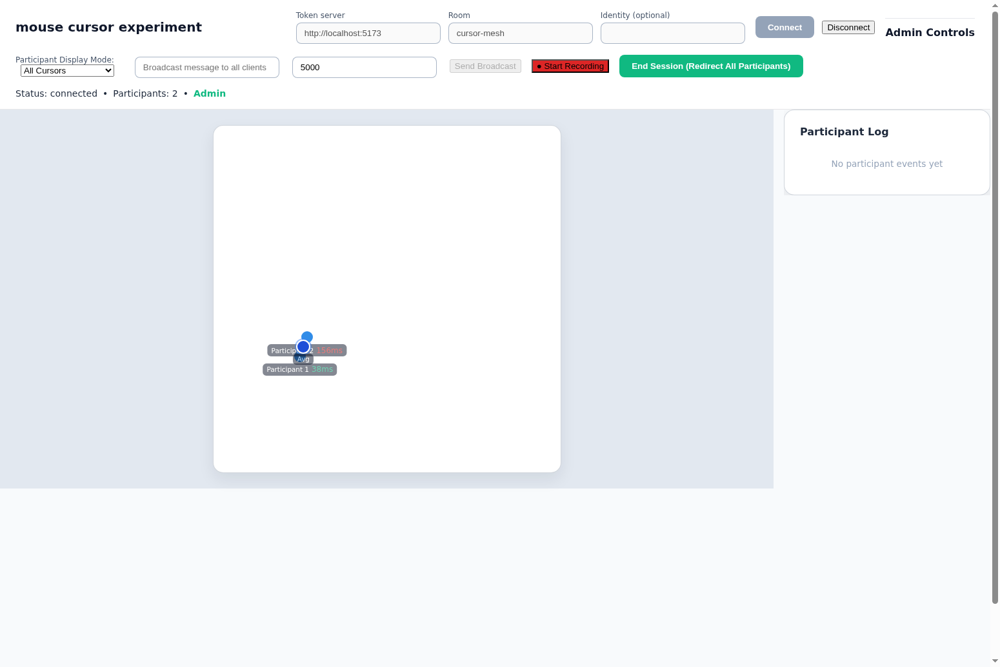
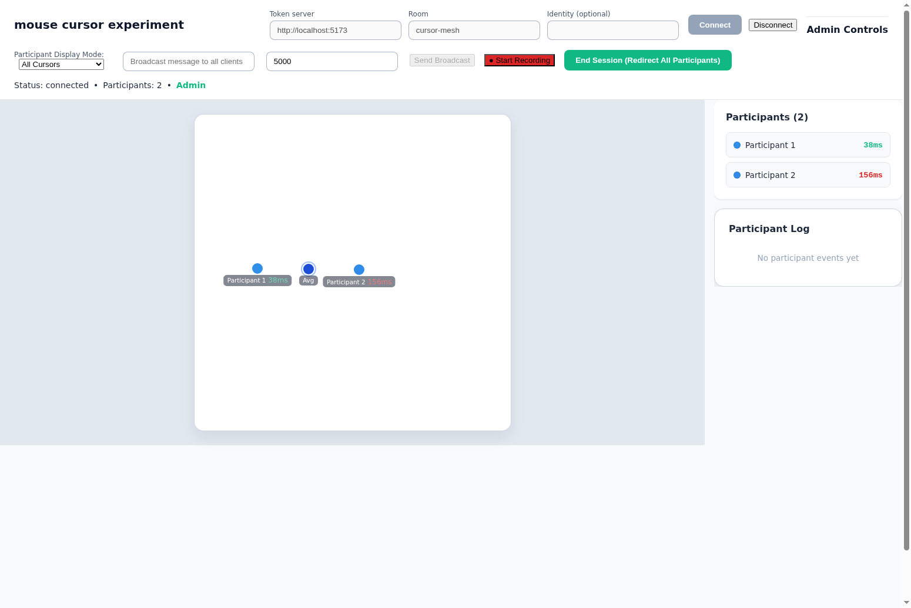

# LiveKit Joint Cursor Task 1

## 🚀 クイックスタート（実験を迅速に実行する場合）

このプロジェクトは既存のLiveKit協調カーソル基盤から分離した、新しい実験プロトコル用の環境です。本番環境は `https://livekit-joint-cursor-task2.onrender.com` です。

### 管理者として接続する

管理者用URL（実験の制御、参加者の監視、録画機能などにアクセス可能）：
```
https://livekit-joint-cursor-task2.onrender.com/?admin=<ADMIN_PASSWORD>
```

管理者パスワードはRenderの `ADMIN_PASSWORD` 環境変数に設定されています。リポジトリには保存しません。

### 参加者として接続する（テスト用）

参加者用URL（Prolific参加者IDをシミュレート）：
```
https://livekit-joint-cursor-task2.onrender.com/?PROLIFIC_PID=test1
```

他の参加者IDでテストする場合は、`test1`を`test2`、`test3`などに変更してください。

### カーソルダミーを使用したテスト

複数の参加者をシミュレートしてシステムの負荷テストを行う場合、ダミーカーソル機能を使用できます：

```
https://livekit-joint-cursor-task2.onrender.com/?PROLIFIC_PID=dummy1&dummy=1
```

ダミーカーソルを有効にすると、マウスを動かさなくても自動的にカーソルが動き続けます（リサージュ曲線パターン）。複数のブラウザウィンドウで異なる参加者IDを使用して開くことで、多数の参加者をシミュレートできます。

**ダミーカーソルのパラメータ**：
- `?dummy=1` または `?dummy=true` - ダミーカーソルを有効化
- `?dummy=0` または `?dummy=false` - ダミーカーソルを無効化

### 基本的な実験フロー

1. **管理者として接続** - 上記の管理者用URLを開く
2. **参加者を招待** - 参加者用URLを複数のブラウザウィンドウまたは他のユーザーと共有
3. **実験を制御** - 管理者画面から以下の操作が可能：
   - 表示モードの変更（全カーソル表示、平均カーソルのみ、自分のカーソルのみ）
   - タスクモードの切り替え（ターゲット追跡タスク、手動インストラクション）
   - ブロードキャストメッセージの送信
   - セッションの録画（60 FPS）
   - セッションの終了（全参加者を完了URLへリダイレクト）
4. **データのダウンロード** - 録画を停止すると、JSONファイルとしてセッションデータをダウンロード可能

---

## Overview

LiveKit Cursor Mesh is a reference implementation of the v2 "100 人同時カーソル共有" specification, evolved into a full behavioral-research platform. It ships with:

- **Token + Agent server** (`packages/server`): issues short-lived LiveKit access tokens **and** runs the `ExperimentAgent`, a config-driven orchestrator that automates wait phases, common instructions, trial loops, recording start/stop, and session end across 5 task types (`circle-target-tracking`, `guide-tracking`, `non-guide-tracking`, `group-circle-target-tracking`, `reaching`).
- **Web client** (`packages/web`): connects to LiveKit over WebRTC DataChannels, broadcasts the local cursor at ~30 Hz, renders every participant + group/single average cursor with **p5.js** (60 fps canvas; see [CURSOR_DESIGN.md](./CURSOR_DESIGN.md)), captures recordings to Supabase, and includes replay / admin / viewer modes.
- **Headless bot simulator + E2E harness** (`scripts/`): drives the room from Node so reaching / rotation / group flows can be tested without real participants.

The original v2 specification is preserved at the bottom of this document for convenience (see [Specification v2](#specification-v2-livekit-cloud-前提)).

---

## システムアーキテクチャ / System Architecture

以下の図は、管理者（Admin）と参加者（Participant）、各サービス（Token Server、LiveKit Cloud、Render.com）の関係を示しています。



### アーキテクチャの主要コンポーネント / Key Architecture Components

#### 1. **Render.com Deployment（デプロイメント環境）**
- **Token Server**: Express.jsベースのマイクロサービス。LiveKit Cloud用のJWTトークンを発行し、管理者認証を処理します。
- **Web Application**: React + Viteで構築されたフロントエンド。本番環境ではToken Serverから静的ファイルとして配信されます。

#### 2. **LiveKit Cloud（リアルタイム通信基盤）**
- **SFU (Selective Forwarding Unit)**: WebRTCベースのリアルタイム通信を提供するサードパーティSaaS。
- **6つのデータチャネル**を使用して、カーソル位置、制御コマンド、メッセージなどを配信します。

#### 3. **Admin（管理者）**
- 実験を制御し、参加者を監視する特権ユーザー。
- **機能**: 表示モード変更、タスクモード切り替え、ブロードキャストメッセージ送信、録画（60 FPS）、セッション終了。
- カーソルデータは送信せず、制御コマンドのみを送信します。

#### 4. **Participants（参加者）**
- Prolificなどから募集された研究参加者（最大100人同時接続）。
- **機能**: カーソル位置の送信（~30Hz）、管理者へのチャットメッセージ送信、管理者からの指示に従う。

### データフロー / Data Flow

1. **認証フロー**: ブラウザ → Token Server → JWTトークン取得 → LiveKit Cloudへ接続
2. **カーソル同期**: 参加者がマウスを動かす → CURSOR_TOPICで配信（非信頼性、~30Hz） → 全参加者に表示
3. **管理者制御**: 管理者が操作 → CONTROL_TOPICで配信（信頼性） → 全参加者に反映
4. **チャット**: 参加者 → CHAT_TOPIC → 管理者のみに配信
5. **レイテンシ監視**: 参加者 → STATS_TOPIC（2秒ごと） → 管理者が確認

---

## Getting Started

### Prerequisites
- Node.js 20+
- LiveKit Cloud project credentials (API Key, API Secret, WebSocket URL)

### 1. Install dependencies

```bash
npm install
```

### 2. Configure the token server

Create `packages/server/.env` using the provided template:

```bash
cp packages/server/.env.example packages/server/.env
```

Fill in the environment variables:

```dotenv
LIVEKIT_API_KEY=lk_...
LIVEKIT_API_SECRET=...
LIVEKIT_WS_URL=wss://<your-project-region>.livekit.cloud
PORT=3001              # optional
TOKEN_TTL_SECONDS=600  # optional (10 minutes)
```

### 3. Run the token server

```bash
npm run dev:server
```

The server exposes two endpoints:
- `GET /healthz` – readiness probe
- `GET /token` – issues a JWT for the requested room (query params: `room`, optional `identity`)

### 4. Run the web client

```bash
npm run dev:web
```

Open `http://localhost:5173` and provide:
- **Token server** – usually `http://localhost:3001`
- **Room** – defaults to `joint-cursor-task2`
- **Identity** (optional) – omit to let the server generate one

Once connected, move the pointer over the stage to stream your position. Every participant is rendered with a deterministic colour, and the aggregate average cursor is highlighted.

### 5. Confirm your production checklist

Before inviting real users, make sure you have the following lined up:

1. **LiveKit Cloud project & quotas** – create the project, verify the `wss://` URL, and confirm the room-participant quota covers 100 concurrent users (request an increase if necessary).
2. **Deployment target for the token service** – choose a Serverless platform (Vercel, Cloud Run, Fly.io, etc.) and provision the required secrets (`LIVEKIT_API_KEY`, `LIVEKIT_API_SECRET`, `LIVEKIT_WS_URL`, `TOKEN_TTL_SECONDS`).
3. **Client configuration** – expose the token service URL to the web client via `VITE_TOKEN_SERVER` at build/deploy time so the browser can fetch tokens securely.
4. **Operational visibility** – optionally register LiveKit webhooks (`participant_joined`, `participant_left`, etc.) to observe room occupancy and detect anomalies early.
5. **Load rehearsal** – run a synthetic load test (or staged user test) that exercises ~100 participants to confirm end-to-end latency and average-cursor rendering stay within the 50–150 ms goal.

### Production Builds

```bash
# Compile the token server (outputs to packages/server/dist)
npm run build --workspace=@cursor/server

# Build the web client bundle (outputs to packages/web/dist)
npm run build --workspace=@cursor/web
```

---

## Task Mode System（タスクモードシステム）

クライアントは描画用に **`TaskMode`** を持ち，エージェントは config から **`ExperimentTaskType`** を解決して試行を組み立てます（両者は 1:1 ではなく，`group-circle-target-tracking` は内部的に `'circle-target-tracking'` の TaskMode で動作する等の対応）。

### Available Task Modes (client-side)

| TaskMode | 説明 |
|---|---|
| `target-tracking` | 三角形ターゲットがランダムに出現（待機フェーズで使用） |
| `circle-target-tracking` | 赤いターゲットが円周上を回る（agent が 20 Hz で配信） |
| `guide-tracking` | 静止した円弧ガイドが描かれる |
| `random-target-tracking` | sum-of-sinusoids 軌跡（Yang, Cowan & Haith 2021） |
| `manual-instruction` | ターゲット無し（Yes/No エリア + 自由運動） |
| `reaching` | 固定位置の円ターゲット。視覚運動回転対応 |


*`target-tracking` モード（三角ターゲット）*


*`manual-instruction` モード*

### Available Experiment Task Types (server-side)

| ExperimentTaskType | trial body の特徴 | TaskMode 連携 |
|---|---|---|
| `circle-target-tracking` | 円軌道ターゲットを前半表示，後半メモリで継続 | `circle-target-tracking` |
| `guide-tracking` | 静止ガイドを前半表示，後半メモリで継続 | `guide-tracking` |
| `non-guide-tracking` | ターゲット/ガイド無し，自由な円運動 | `manual-instruction` |
| `group-circle-target-tracking` | グループ split → reshuffle → merge の 3 フェーズ | `circle-target-tracking` |
| `reaching` | 黄→赤の Go 信号 + 視覚運動回転（pre/rot/post） | `reaching` |

実装は `packages/server/src/experiments/<task-id>/` にあります。詳細は [CLAUDE.md](./CLAUDE.md) と [CURSOR_DESIGN.md](./CURSOR_DESIGN.md) を参照。

### Admin Controls

Admin 画面の Task Mode ボタンから手動で TaskMode を切り替え可能ですが，通常運用では **`/?admin=agent` のエージェント設定 UI** から `ExperimentTaskType` を選び，Save Config → Start Agent するのが推奨フローです（待機 → 11 共通指示 → 試行ループ → 終了が完全自動化される）。

### Extensibility

新タスク追加の流れ:
1. **サーバ**: `packages/server/src/experiments/<new-task>/` に `instructions.ts`, `experiment.ts`, `index.ts` を作成 → `experiments/index.ts` の `taskRegistry` に登録 → `agent-rules.ts` の `ExperimentTaskType` に追加
2. **Web**: `packages/web/src/experiments/<new-task>/sketch.ts` を作成し，`registry.ts` に登録（任意。base sketch だけで足りるなら不要）
3. **UI**: `AgentAdmin.tsx` の `TASK_TYPE_LABELS` とボタン一覧に追加

詳細は [CLAUDE.md](./CLAUDE.md) の "Where to Change What" テーブルと [CURSOR_DESIGN.md](./CURSOR_DESIGN.md) §7 を参照。

### Technical Implementation

- **Task Mode の伝達**: `taskControl` 制御メッセージ（reliable）。サーバ送信は admin・participant 両方が受理
- **描画**: 全ステージビジュアルは **p5.js**（`<TaskStage>` 内のキャンバス 1 枚）。共通要素（参加者/平均カーソル，Yes/No）は `base-sketch.ts`，タスク固有要素（ターゲット形状，ガイド円）は `<task-id>/sketch.ts` の `drawTaskLayer` が描画
- **ターゲット配信**: `circle-target-tracking` は agent が直接 20 Hz で TARGET_TOPIC に publish。`reaching` は静的位置を `publishStaticTarget` で 1 回送る
- **記録**: 60 fps で `captureFrame` が `FrameSnapshot` を蓄積，停止時に Supabase へバッチ送信

---

## エージェント自動化 / Agent Automation

### 概要

エージェント機能は、管理者が手動で行っていた実験制御（インストラクション表示、表示モード変更、Yes/Noエリア確認、セッション終了など）を自動化します。エージェントはサーバープロセス内で動作し、`RoomServiceClient`（LiveKit HTTP API）を通じてルームにコントロールメッセージを送信します。

**重要**: エージェントはLiveKitルームに参加者として参加しません。サーバーサイドAPIを使用してメッセージを送信するため、参加者リストにエージェントは表示されず、カーソルも持ちません。

### エージェントのアーキテクチャ

```
管理者ブラウザ (?admin=agent)
    │
    ├── POST /agent/start      → エージェント開始
    ├── POST /agent/stop       → エージェント停止
    ├── POST /agent/reset      → エージェントリセット
    ├── GET  /agent/status     → ステータス取得
    ├── GET  /agent/rules      → ルール取得
    └── POST /agent/rules      → ルール更新
                │
                ▼
    Express Server (ExperimentAgent)
        │
        ├── RoomServiceClient.listParticipants() → 参加者数の確認
        ├── RoomServiceClient.sendData()         → コントロールメッセージ送信
        │     ├── CONTROL_TOPIC: 表示モード、Yes/No、セッション終了
        │     └── BROADCAST_TOPIC: インストラクション表示
        │
        └── POST /agent/area-report ← 参加者からのカーソルエリア報告
```

### エージェント設定画面へのアクセス

エージェント管理UIにアクセスするには、URLパラメータ `?admin=agent` を使用します。

```
# ローカル開発
http://localhost:5173/?admin=agent

# 本番環境（Render.com）
https://livekit-joint-cursor-task2.onrender.com/?admin=agent
```

アクセスすると、管理者パスワードの入力画面が表示されます。パスワードはサーバーの `ADMIN_PASSWORD` 環境変数に設定された値です。

URLにパスワードを含めて自動認証することもできます:

```
http://localhost:5173/?admin=agent&password=<ADMIN_PASSWORD>
```

### エージェントの使い方

> **重要**: 現行のエージェント UI は**コンフィグベース**です。タスクタイプとパラメータをフォームで入力し、ルールはサーバーが自動生成します。生成された個別ルールは画面下部の "Generated Rules" で読み取り専用で確認できます。手動でルール配列を編集したい場合のみ `POST /agent/rules` API を直接呼んでください（`AgentAdmin.tsx` UI ではサポートしていません）。

#### 1. 実験コンフィグを設定する

エージェント管理画面（`?admin=agent`）で、フォーム形式で以下を設定します：

| 項目 | 説明 | デフォルト |
|------|------|-----------|
| **Task Type** | 4種から選択（後述） | Circle Target Tracking |
| **Number of Trials** | トライアル数（グループ実験では「フェーズあたり」） | 5 |
| **Trial Duration** | 1試行の秒数 | 20 |
| **Wait Time** | 参加者待機の最大時間（分） | 10 |
| **Min Participants** | 最低必要参加者数 | 10 |
| **Instruction Duration** | 各インストラクション表示時間（秒） | 4 |
| **Circle Target Period** | サークル一周のミリ秒（circle/group-circle のみ） | 5000 |
| **Circle/Guide Radius** | サークル/ガイドの半径 0–0.5（circle/guide/group-circle） | 0.3 |

**利用可能なタスクタイプ**：
- **Circle Target Tracking** — 円運動するターゲットを平均カーソルで追跡。前半はターゲット表示、後半は記憶から継続。
- **Guide Tracking** — 円弧ガイドを表示し平均カーソルでなぞる。前半はガイド表示、後半は記憶から継続。
- **Non-guide Tracking (Free Circular)** — ターゲット/ガイドなしで自由に円運動。
- **Group Circle Target Tracking** — Circle Target Tracking のグループ版。参加者をランダムに 2 グループに分け、5 試行 → グループ再シャッフル 5 試行 → 全員 1 グループに統合 5 試行（合計 15 試行）。各グループは独自の平均カーソルを持つ。詳細は[グループ実験](#グループ実験--group-experiments)参照。

#### 2. 設定を保存・エージェントを開始する

- **Save Config** — フォームの内容をサーバーに保存。サーバーが自動的にルール列を生成（`generateRulesFromConfig`）。
- **Start Agent** — Save Config + 開始を一括実行。エージェントは生成されたルール列を上から順に実行します。

#### 3. 実行中の監視

エージェント管理画面で以下の情報をリアルタイムで確認できます:
- **ステータス**: idle（待機中）/ running（実行中）/ completed（完了）/ error（エラー）/ stopped（停止）
- **現在のステップ**: 何番目のルールを実行中か
- **参加者数**: 現在の参加者数
- **経過時間**: エージェント開始からの経過時間

#### 4. エージェントを停止・リセットする

- **Stop Agent**: 実行中のエージェントを即座に停止
- **Reset Agent**: エージェントを初期状態（idle）に戻す

**注意**: エージェントはサーバーサイドで動作するため、ブラウザを閉じても実行は継続します。再度エージェント管理画面を開けば、現在のステータスを確認できます。ただし、サーバーが再起動した場合（Renderのフリープランでのスリープなど）、エージェントの状態はリセットされます。

### ルールタイプ一覧

#### 1. `waitForParticipants` — 参加者待機

指定した人数の参加者が集まるまで待機します。タイムアウトに達した場合は、現在の人数で次のステップに進みます。

| パラメータ | 型 | 説明 | デフォルト |
|-----------|-----|------|-----------|
| `minParticipants` | number | 最低参加者数 | 10 |
| `timeoutMinutes` | number | タイムアウト（分） | 15 |

**例**: 「10人の参加者が集まったら開始。ただし15分経ったら現在の人数で開始」
```json
{
  "type": "waitForParticipants",
  "minParticipants": 10,
  "timeoutMinutes": 15
}
```

#### 2. `showInstruction` — インストラクション表示

全参加者の画面にメッセージを表示します。

| パラメータ | 型 | 説明 | デフォルト |
|-----------|-----|------|-----------|
| `text` | string | 表示するメッセージ | — |
| `durationMs` | number | 表示時間（ミリ秒） | 5000 |
| `waitForDuration` | boolean | 表示終了を待ってから次へ | true |

**例**:
```json
{
  "type": "showInstruction",
  "text": "実験を開始します。指示に従ってください。",
  "durationMs": 5000,
  "waitForDuration": true
}
```

#### 3. `setDisplayMode` — 表示モード変更

参加者のカーソル表示モードを変更します。

| パラメータ | 型 | 説明 |
|-----------|-----|------|
| `mode` | string | 表示モード |

**利用可能なモード**:
- `all-without-avg`: 全カーソル表示（平均カーソルなし）
- `all-with-avg-lines`: 全カーソル+平均カーソル（ラインあり）
- `all-with-avg-no-lines`: 全カーソル+平均カーソル（ラインなし）
- `avgOnly`: 平均カーソルのみ
- `self`: 自分のカーソルのみ

#### 4. `setTaskMode` — タスクモード変更

実験のタスクモードを変更します。

| パラメータ | 型 | 説明 |
|-----------|-----|------|
| `taskMode` | string | タスクモード |

**利用可能なモード**:
- `target-tracking`: ターゲット追跡
- `manual-instruction`: 手動インストラクション
- `circle-target-tracking`: サークルターゲット追跡
- `guide-tracking`: ガイド追跡
- `random-target-tracking`: ランダムターゲット追跡

#### 5. `showYesNoAreas` — Yes/Noエリア表示

Yes/Noエリアを表示し、参加者のカーソルが指定エリア内に入るのを待ちます。参加者のカーソル位置は1秒ごとにサーバーに報告されます。

| パラメータ | 型 | 説明 | デフォルト |
|-----------|-----|------|-----------|
| `requiredArea` | `'yes'` / `'no'` / `'any'` | 確認するエリア | `'yes'` |
| `requiredRatio` | number | 必要な参加者の割合（0.0〜1.0） | 0.8 |
| `timeoutSeconds` | number | タイムアウト（秒） | 60 |

**例**: 「Yesエリアに80%の参加者のカーソルが入ったら次へ。60秒でタイムアウト」
```json
{
  "type": "showYesNoAreas",
  "requiredArea": "yes",
  "requiredRatio": 0.8,
  "timeoutSeconds": 60
}
```

#### 6. `hideYesNoAreas` — Yes/Noエリア非表示

Yes/Noエリアを非表示にします。パラメータはありません。

#### 7. `wait` — 待機

指定した秒数だけ待機します。

| パラメータ | 型 | 説明 |
|-----------|-----|------|
| `durationSeconds` | number | 待機時間（秒） |

#### 8. `setCursorVisibility` — カーソル表示/非表示

参加者のカーソルの表示・非表示を切り替えます。

| パラメータ | 型 | 説明 |
|-----------|-----|------|
| `hideCursor` | boolean | `true`で非表示、`false`で表示 |

#### 9. `enableVirtualCursor` — 仮想カーソル有効化＆ロック待機

参加者の仮想カーソル（Pointer Lock）を有効化し、全員がロックされるまで待機します。

| パラメータ | 型 | 説明 |
|-----------|-----|------|
| `timeoutSeconds` | number | タイムアウト（秒） |

#### 10. `resetVirtualCursorPosition` — 仮想カーソル位置リセット

全参加者の仮想カーソル位置を中央 (0.5, 0.5) にリセットします。パラメータなし。

#### 11. `setClickAreaOverlay` — クリックエリアオーバーレイ表示/非表示

ステージ中央のクリックエリア（仮想カーソル開始用）の表示状態を切り替えます。

| パラメータ | 型 | 説明 |
|-----------|-----|------|
| `show` | boolean | `true`で表示、`false`で非表示 |

#### 12. `startRecording` — 録画開始

Admin クライアントに録画開始を指示します（要 Admin 接続）。

| パラメータ | 型 | 説明 |
|-----------|-----|------|
| `experimentName` | string | 実験名（DB の `recordings.experiment_name`） |
| `trialNumber` | number | 試行番号 |

#### 13. `stopRecordingAndUpload` — 録画停止＆アップロード待機

録画停止を指示し、Admin クライアントが Supabase へアップロード完了するまで待機します。

| パラメータ | 型 | 説明 |
|-----------|-----|------|
| `timeoutSeconds` | number | アップロード完了の待機タイムアウト |

#### 14. `executeTrial` — トライアル実行（複合ルール）

1試行分の処理（前準備メッセージ→display 切替→録画開始→"Start"表示→**タスク本体**→録画停止＆アップロード待ち→display 戻し→次試行案内）を一括実行します。タスク本体は `experiments/<task-id>/experiment.ts` の `runTrialBody` に委譲されます。

| パラメータ | 型 | 説明 |
|-----------|-----|------|
| `trialNumber` | number | 試行番号 |
| `totalTrials` | number | 総試行数 |
| `durationSeconds` | number | 試行秒数 |
| `taskType` | ExperimentTaskType | どのタスクか |
| `experimentName` | string | 実験名 |
| `circleTargetPeriod` | number? | サークル一周のミリ秒 |
| `circleTargetRadius` | number? | サークル半径 |

通常は `generateRulesFromConfig(config)` で自動生成されるため、手動で構築する必要はありません。

#### 15. `computeGroups` — グループ無作為割当

現在の非 admin 参加者を Fisher-Yates シャッフルして N グループに均等分割し、`setGroupAssignments` 制御メッセージを全参加者にブロードキャストします。`groupCount: 1` で全員を1グループに統合（クリア相当）。

| パラメータ | 型 | 説明 |
|-----------|-----|------|
| `groupCount` | number | グループ数 (1 = グループなし) |

#### 16. `endSession` — セッション終了

実験セッションを終了し、全参加者を完了URLにリダイレクトします。

| パラメータ | 型 | 説明 |
|-----------|-----|------|
| `completionUrl` | string (任意) | リダイレクト先URL。省略時はProlificデフォルトURL |

### デフォルトルール設定

エージェントには以下のデフォルトルールが事前に設定されています:

1. **参加者待機**: 10人を待機（タイムアウト15分）
2. **インストラクション表示**: "The experiment will now begin..." (5秒)
3. **表示モード設定**: 全カーソル表示（平均カーソルなし）
4. **カーソル表示**: カーソルを表示状態にする
5. **Yes/Noエリア**: Yesエリアに80%の参加者が入るまで待機（タイムアウト60秒）
6. **Yes/Noエリア非表示**
7. **終了メッセージ**: "Thank you for your participation..." (5秒)
8. **セッション終了**: 参加者をProlific完了URLにリダイレクト

### ルール設定の実用例

#### 例1: シンプルな実験

```json
[
  { "type": "waitForParticipants", "minParticipants": 5, "timeoutMinutes": 10 },
  { "type": "showInstruction", "text": "実験を開始します", "durationMs": 3000, "waitForDuration": true },
  { "type": "setDisplayMode", "mode": "all-without-avg" },
  { "type": "setTaskMode", "taskMode": "target-tracking" },
  { "type": "wait", "durationSeconds": 120 },
  { "type": "showInstruction", "text": "お疲れ様でした", "durationMs": 5000, "waitForDuration": true },
  { "type": "endSession" }
]
```

#### 例2: 同意確認付きの実験

```json
[
  { "type": "waitForParticipants", "minParticipants": 10, "timeoutMinutes": 15 },
  { "type": "showInstruction", "text": "これから実験を開始します。同意される方はYesエリアにカーソルを移動してください。", "durationMs": 8000, "waitForDuration": true },
  { "type": "showYesNoAreas", "requiredArea": "yes", "requiredRatio": 0.9, "timeoutSeconds": 60 },
  { "type": "hideYesNoAreas" },
  { "type": "showInstruction", "text": "確認ありがとうございます。実験を開始します。", "durationMs": 3000, "waitForDuration": true },
  { "type": "setDisplayMode", "mode": "all-with-avg-lines" },
  { "type": "setTaskMode", "taskMode": "target-tracking" },
  { "type": "wait", "durationSeconds": 180 },
  { "type": "endSession" }
]
```

### API エンドポイント

全てのエンドポイントは管理者パスワードによる認証が必要です（`area-report`を除く）。クエリパラメータまたはボディの `adminPassword` フィールドで認証します。

| メソッド | パス | 説明 |
|---------|------|------|
| `GET` | `/agent/status?adminPassword=XXX` | エージェントの現在のステータスを取得 |
| `GET` | `/agent/rules?adminPassword=XXX` | 設定されたルール一覧を取得 |
| `POST` | `/agent/rules` | ルールを更新（body: `{ adminPassword, rules }`) |
| `POST` | `/agent/start` | エージェントを開始（body: `{ adminPassword }`) |
| `POST` | `/agent/stop` | エージェントを停止（body: `{ adminPassword }`) |
| `POST` | `/agent/reset` | エージェントをリセット（body: `{ adminPassword }`) |
| `POST` | `/agent/area-report` | カーソルエリア報告（認証不要、body: `{ identity, area }`) |

### ファイル構成

| ファイル | 説明 |
|---------|------|
| `packages/server/src/agent-rules.ts` | ルールの型定義、`describeRule()` |
| `packages/server/src/agent.ts` | `ExperimentAgent` クラス（ルール実行エンジン） |
| `packages/server/src/index.ts` | エージェント API エンドポイント |
| `packages/server/src/experiments/` | **タスク別実験スクリプト**（後述） |
| `packages/web/src/AgentAdmin.tsx` | エージェント管理 UI（React、コンフィグベース） |

### 実験スクリプトの構造（`packages/server/src/experiments/`）

実験フローはタスクタイプごとにディレクトリに分かれています。新しい実験課題を追加するときは、このディレクトリに新規ディレクトリを作成して `taskRegistry` に登録するだけで済みます。

```
experiments/
├── index.ts                          # Registry + generateRulesFromConfig
├── types.ts                          # ExperimentTask, TrialContext interfaces
├── common-flow.ts                    # 全タスク共通: 待機 + 11 共通指示 + 終了 3 指示
├── circle-target-tracking/
│   ├── instructions.ts               # タスク固有の 5 つの指示文
│   ├── experiment.ts                 # runTrialBody: 1 試行分の動作（ターゲット制御）
│   └── index.ts                      # ExperimentTask オブジェクトとしてエクスポート
├── guide-tracking/                   # 同じ 3 ファイル構成
├── non-guide-tracking/
└── group-circle-target-tracking/     # ★ グループ実験（後述）
```

各タスクは `ExperimentTask` インターフェースを実装します：

```ts
interface ExperimentTask {
  type: ExperimentTaskType;
  label: string;
  liveKitTaskMode: TaskMode;                                       // トライアル時の task mode
  generateInstructions(config): string[];                          // タスク前に表示する指示文
  runTrialBody(ctx: TrialContext): Promise<void>;                  // 1 試行分の動作
  generateTrialSequence?(config, expName): AgentRule[];            // 任意: トライアル列のカスタマイズ
}
```

**新タスク追加の手順**：
1. `experiments/<新タスク>/` に `instructions.ts`, `experiment.ts`, `index.ts` を作成
2. `agent-rules.ts` の `ExperimentTaskType` ユニオンに型を追加
3. `experiments/index.ts` の `taskRegistry` に登録
4. `web/src/AgentAdmin.tsx` のボタンとラベルに追加

---

## グループ実験 / Group Experiments

### 概要

`group-circle-target-tracking` タスクは、Circle Target Tracking のグループ版です。参加者をランダムに 2 つのグループに分け、各グループは独自の平均カーソルを使ってターゲットを追跡します。

**実験フロー（デフォルト 15 試行）**：

| フェーズ | グループ構成 | 試行 |
|---------|-------------|------|
| Phase 1 | 無作為に 2 グループに分割 | 1–5 |
| Phase 2 | グループを再シャッフル（再度無作為 2 グループ） | 6–10 |
| Phase 3 | 全員を 1 グループに統合 | 11–15 |

`config.trialCount` は**フェーズあたりの試行数**として解釈されます（合計 = 3 × trialCount）。

### グループの仕組み

- **割当**: サーバーの `computeGroups` ルールが Fisher-Yates シャッフル → ラウンドロビンでグループ均等分割（サイズの差は最大 1）。
- **配信**: `setGroupAssignments` 制御メッセージで `{ identity → groupId, groupCount }` を全参加者にブロードキャスト。
- **平均カーソルのフィルタ**:
  - **参加者**: 自分のグループに属するカーソルのみで平均を計算（自分のグループの平均だけが見える）
  - **Admin / Viewer**: 全グループの平均を色分け表示（Group 0 = 青、Group 1 = 緑、…）
- **タイムアウト時の動作**: 10 人集まらなくても `waitTimeMinutes` 経過後に進行。集まった人数で均等分割するため、4 人 → 2+2、7 人 → 4+3 など。

### 録画データへの保存

グループ情報は録画データに自動的に含まれます：

| 列 | テーブル | 内容 |
|----|---------|------|
| `group_assignments` | `recordings` | 録画開始時点の `{ identity → groupId }` JSONB |
| `group_count` | `recordings` | グループ数（1 = グループなし） |
| `group_averages` | `frames` | 各フレームの `{ "0": {x, y}, "1": {x, y} }` JSONB |
| `cursors[].groupId` | `frames`（既存 JSONB 内） | 各カーソルの所属グループ |

リプレイ機能は自動でこれらを読み込み、グループごとに色分け表示します。Database Admin の Replay Modal で当時のグループ構成と各グループの平均軌跡を再現できます。

### 推奨テスト手順

```bash
# ターミナル 1: トークンサーバー
npm run dev:server

# ターミナル 2: Web
npm run dev:web

# ターミナル 3: ヘッドレスボット 10 体
npx tsx scripts/simulate-participants.ts --count 10
```

ブラウザで：
1. `http://localhost:5173/?admin=<pass>` — メイン Admin（録画と複数 avg 表示の確認用）
2. `http://localhost:5173/?admin=agent` — Task Type で "Group Circle Target Tracking" を選択 → Save → Start Agent
3. （任意）`http://localhost:5173/?admin=viewer` — プロジェクター用

### 実装ファイル

| ファイル | 説明 |
|---------|------|
| `experiments/group-circle-target-tracking/index.ts` | `generateTrialSequence` でフェーズ列を構築 |
| `experiments/group-circle-target-tracking/instructions.ts` | グループ前提のタスク指示文 |
| `experiments/group-circle-target-tracking/experiment.ts` | Circle Target Tracking の trial body を再エクスポート |
| `agent.ts` の `execComputeGroups` | サーバー側のグループ無作為割当ロジック |
| `App.tsx` の `groupAssignments` state | クライアント側のグループ状態 |
| `App.tsx` の `groupAverages` useMemo | per-group 平均カーソル計算（admin/viewer 用） |
| `App.tsx` の `colorForGroup(gid)` | グループごとの色（青/緑/橙/紫/水/ピンク） |

---

## Prolific Integration（オンライン研究用統合機能）

このプロジェクトは、Prolificなどのオンライン研究プラットフォームとの統合機能を提供します。研究参加者向けに最適化されたUIと、研究管理者向けの制御機能が含まれています。

### 主要機能

#### 1. 同意書・インストラクション画面
研究参加者が最初にアクセスした際に、研究の詳細説明と同意フォームが表示されます。

**特徴**:
- 研究の目的、手順、所要時間、データ収集内容を明示
- 「同意して続ける」ボタンで同意を確認
- 「同意しない」ボタンでウィンドウを閉じる（ブラウザのセキュリティ制限により動作しない場合あり）
- シミュレーションモード（`?sim`パラメータ）では表示されない
- **重要な指示セクション（Important Instructions）は赤字で表示**され、参加者の注意を引きます

**重要な指示セクション（赤字表示）**:
同意画面の最後に表示される「Important Instructions」セクションは、実験の重要な注意事項を赤色（#dc2626）で強調表示します。このセクションには以下の内容が含まれます：
- 実験は予定人数に達したら開始されること
- 他のブラウザウィンドウ・タブを閉じること
- 実験開始後はブラウザタブを閉じないこと
- タブを閉じると実験が継続できず、謝礼が支払えなくなること

この赤字表示は、CSSクラス`.important-instructions`によって実装されており、`!important`フラグを使用して子要素（h3、p、li）の色を確実に上書きしています。

**カスタマイズ方法**:
`packages/web/src/App.tsx`の`ConsentScreen`コンポーネント内のテキストを編集してください。研究の具体的な内容に合わせて変更することを推奨します。赤字表示を変更する場合は、`packages/web/src/styles.css`の`.important-instructions`クラスを編集してください。

#### 2. Prolific参加者ID（PID）の自動抽出
URLパラメータから参加者IDを自動的に抽出し、ユーザーIDとして使用します。

**対応パラメータ**:
- `PID` - Prolific標準パラメータ
- `pid` - 小文字版
- `PROLIFIC_PID` - 代替パラメータ

**使用例**:
```
https://your-app.com/?PID=5f8a7b2c3d4e5f6a7b8c9d0e
```

PIDが存在しない場合は、ランダムなUUIDが自動生成されます。

#### 3. 参加者→管理者チャット機能
研究参加者が管理者（Admin）にメッセージを送信できる機能です。

**参加者側**:
- 接続後、画面下部に「Chat with Admin」セクションが表示される
- テキスト入力欄にメッセージを入力し、「Send」ボタンまたはEnterキーで送信
- 送信確認は表示されない（意図的な設計）

**管理者側**:
- 管理者として接続すると、画面右側に「Participant Messages」パネルが表示される
- 全参加者からのメッセージが時系列で表示される
- 各メッセージには送信者のIDとタイムスタンプが付与される

**技術詳細**:
- LiveKitの信頼性データチャネル（Reliable DataChannel）を使用
- トピック: `chat`
- 配信保証あり（メッセージの欠落なし）

#### 4. 管理者による一斉セッション完了
管理者が全参加者のセッションを一斉に終了し、完了URLへリダイレクトできます。

**使用方法**:
1. 管理者として接続（Admin Passwordを入力）
2. Admin Controlsセクションの「End Session (Redirect All Participants)」ボタンをクリック
3. 全参加者のブラウザが自動的に完了URLへリダイレクトされる
4. 管理者自身はリダイレクトされない

**完了URLの設定**:
`packages/web/src/App.tsx`の`COMPLETION_URL`定数を編集するか、環境変数`VITE_COMPLETION_URL`を設定してください。

```typescript
// App.tsx内
const COMPLETION_URL = 'https://app.prolific.com/submissions/complete?cc=CFL5QARB';
```

または

```bash
# .env.local
VITE_COMPLETION_URL=https://app.prolific.co/submissions/complete?cc=YOUR_COMPLETION_CODE
```

**重要**: `XXXXXXXX`を実際のProlific完了コードに置き換えてください。

### UI簡素化機能

#### 参加者モード（デフォルト）
研究参加者向けに、技術的な設定項目を非表示にしています。

**表示される項目**:
- Admin Password (optional) - 管理者になるためのパスワード入力欄
- Connect / Disconnect ボタン

**非表示の項目**:
- Token server URL
- Room name
- Identity (optional)

#### 詳細設定の表示条件
以下のいずれかの条件で詳細設定が表示されます：

1. **Admin Passwordを入力した時**（接続前）
   - パスワードフィールドに文字を入力すると自動的に表示される
   - 管理者意図の検出

2. **管理者として接続した後**
   - 正しいAdmin Passwordで接続すると、接続後も表示され続ける

3. **シミュレーションモード**
   - URLに`?sim`パラメータがある場合、常に表示される

4. **URLオーバーライド**
   - `?advanced`または`?admin=1`パラメータで強制表示

**使用例**:
```bash
# 参加者モード（デフォルト）
https://your-app.com/?PID=participant123

# 詳細設定を強制表示
https://your-app.com/?advanced

# 管理者モード（詳細設定のみ表示）
https://your-app.com/?admin=1

# 管理者として自動認証
https://your-app.com/?admin=<ADMIN_PASSWORD>
```

#### 5. マウスアウト時のインストラクション表示
参加者モードでは、マウスカーソルが540x540pxのステージエリアから外れた際に、自動的にインストラクションが表示されます。

**特徴**:
- 赤い半透明背景（透過度60%）で画面中央に表示
- 白い文字で「Please keep your mouse within the white square area」と表示
- マウスがステージエリアに戻ると自動的に非表示
- 管理者モードでは表示されない（参加者のみ）

**表示条件**:
- 接続状態が「connected」である
- 管理者ではない（参加者モード）
- マウスカーソルがステージエリアから離れた時


*マウスアウト時のインストラクション表示例：赤い半透明背景に白い文字でインストラクションが表示されます*

### URLパラメータ一覧

| パラメータ | 説明 | 使用例 |
|-----------|------|--------|
| `PID`, `pid`, `PROLIFIC_PID` | Prolific参加者ID | `?PID=5f8a7b2c3d4e` |
| `sim` | シミュレーションモード（管理者権限、詳細設定表示） | `?sim` |
| `dummy` | ダミーカーソルの有効化 | `?dummy` または `?dummy=true` |
| `dummy=false` | ダミーカーソルの無効化 | `?dummy=false` または `?dummy=0` |
| `advanced` | 詳細設定の強制表示 | `?advanced` |
| `admin=1` | 詳細設定の強制表示（代替） | `?admin=1` |
| `admin=<ADMIN_PASSWORD>` | 管理者パスワードで認証（自動ログイン） | `?admin=<ADMIN_PASSWORD>` |
| `admin=agent` | エージェント設定画面を表示 | `?admin=agent` |
| `admin=agent&password=XXX` | エージェント設定画面（パスワード付き） | `?admin=agent&password=<ADMIN_PASSWORD>` |

**複数パラメータの組み合わせ**:
```bash
# Prolific参加者でダミーカーソル有効
https://your-app.com/?PID=participant123&dummy

# 管理者モードでダミーカーソル有効
https://your-app.com/?sim&dummy
```

### 管理者機能（Admin Controls）

管理者として接続すると、以下の追加機能が利用できます：

#### 1. 表示モード制御
全参加者の表示モードを一斉に変更できます。

**モード**:
- **All Cursors** - 全参加者のカーソルを表示（デフォルト）
- **Average Only** - 平均カーソルのみ表示
- **Self Only** - 自分のカーソルのみ表示

**使用方法**:
「Participant Display Mode」ドロップダウンから選択すると、全参加者の画面に即座に反映されます。

#### 2. ブロードキャストメッセージ
全参加者の画面中央にメッセージを表示できます。

**使用方法**:
1. テキスト入力欄にメッセージを入力
2. 表示時間（ミリ秒）を設定（1000〜30000ms、デフォルト5000ms）
3. 「Send Broadcast」ボタンをクリック

**メッセージの種類**:
- 通常メッセージ（青色背景）
- 警告メッセージ（黄色背景） - 実装は将来対応
- エラーメッセージ（赤色背景） - 実装は将来対応

**表示特性**:
- メッセージは画面中央に60%透過で表示されます
- カーソル表示が後ろに透けて見えるため、参加者の動きを確認しながらメッセージを送信できます
- 録画機能を使用している場合、送信されたメッセージとタイムスタンプが自動的に録画データに記録されます


*ブロードキャストメッセージの表示例：60%透過により、カーソルが後ろに見えています*

#### 3. 録画機能
全参加者のカーソル位置を記録し、後で分析できます。

**使用方法**:
1. 「● Start Recording」ボタンで録画開始
2. 「■ Stop Recording」ボタンで録画停止
3. 「⬇ Download Recording」ボタンでJSONファイルをダウンロード
4. 「Clear Recording」ボタンで録画データをクリア

**ステージエリアの座標系 / Stage Area Coordinate System**:

録画データ内のカーソル座標（`x`, `y`）は、以下の座標系に基づいて正規化されています。

| 項目 | 値 | 説明 |
|------|-----|------|
| **ステージサイズ** | 540×540 px | 正方形のステージエリア |
| **座標範囲** | 0.0 〜 1.0 | 正規化された座標値 |
| **原点 (0, 0)** | 左上隅 | ステージの左上角が原点 |
| **X軸正方向** | 右方向 | x=0.0（左端）→ x=1.0（右端） |
| **Y軸正方向** | 下方向 | y=0.0（上端）→ y=1.0（下端） |
| **中心座標** | (0.5, 0.5) | ステージの中央 |

```
    x=0.0                x=0.5                x=1.0
y=0.0 ┌─────────────────────┬─────────────────────┐
      │                     │                     │
      │    (0.25, 0.25)     │    (0.75, 0.25)     │
      │                     │                     │
y=0.5 ├─────────────────────┼─────────────────────┤
      │                     │                     │
      │    (0.25, 0.75)     │    (0.75, 0.75)     │
      │                     │                     │
y=1.0 └─────────────────────┴─────────────────────┘
```

**座標変換の例**:
- ピクセル座標 → 正規化座標: `normX = pixelX / 540`, `normY = pixelY / 540`
- 正規化座標 → ピクセル座標: `pixelX = normX * 540`, `pixelY = normY * 540`

**録画データ形式**:

> **注**: 下記の例にはグループ実験で使われる任意フィールドも含まれています：
> - 録画レベル: `groupAssignments` — 録画開始時点のグループ割当スナップショット
> - フレームレベル: `groupAverages` — 各グループの平均カーソル位置
> - カーソルレベル: `groupId` — そのカーソルが属するグループ
>
> グループ非対応の実験ではこれらは省略されます（後方互換）。

```json
{
  "roomName": "joint-cursor-task2",
  "startTime": 1234567890000,
  "endTime": 1234567900000,
  "frameRate": 60,
  "groupAssignments": {
    "assignments": { "p1": 0, "p2": 0, "p3": 1, "p4": 1 },
    "groupCount": 2
  },
  "frames": [
    {
      "timestamp": 1234567890100,
      "frameNumber": 0,
      "cursors": [
        {
          "identity": "p1",
          "displayName": "p1",
          "x": 0.4,
          "y": 0.5,
          "hash": 12345,
          "isLocal": false,
          "groupId": 0
        }
      ],
      "average": { "x": 0.5, "y": 0.5 },
      "groupAverages": {
        "0": { "x": 0.4, "y": 0.5 },
        "1": { "x": 0.6, "y": 0.5 }
      }
    }
  ],
  "broadcastMessages": [
    {
      "type": "broadcast",
      "text": "Welcome to the experiment!",
      "durationMs": 5000,
      "severity": "info",
      "timestamp": 1234567890500,
      "id": "1234567890500-0.123456"
    }
  ],
  "events": [
    {
      "type": "recordingStarted",
      "t": 0
    },
    {
      "type": "displayModeChanged",
      "mode": "avgOnly",
      "t": 5000
    },
    {
      "type": "broadcast",
      "text": "Welcome to the experiment!",
      "duration": 5000,
      "severity": "info",
      "t": 5500
    },
    {
      "type": "sessionEnded",
      "completionUrl": "https://app.prolific.com/submissions/complete?cc=CFL5QARB",
      "t": 120000
    },
    {
      "type": "recordingStopped",
      "t": 120100
    }
  ]
}
```

**イベント配列（events）の詳細**:
録画データには、管理者が実行した操作を記録する`events`配列が含まれます。各イベントには相対タイムスタンプ（`t`）が付与され、録画開始時刻（`startTime`）からの経過時間（ミリ秒）を表します。

**記録されるイベントタイプ**:
1. **recordingStarted** - 録画開始（常に t=0）
2. **recordingStopped** - 録画停止
3. **displayModeChanged** - 表示モード変更
   - `mode`: "all" | "avgOnly" | "self"
4. **broadcast** - ブロードキャストメッセージ送信
   - `text`: メッセージ内容
   - `duration`: 表示時間（ミリ秒）
   - `severity`: "info" | "warning" | "error"
5. **sessionEnded** - セッション終了（全参加者リダイレクト）
   - `completionUrl`: リダイレクト先URL

**使用例**:
```javascript
// JSONファイルを読み込んで分析
const recording = JSON.parse(jsonData);

// 録画時間を計算
const duration = recording.endTime - recording.startTime;
console.log(`Recording duration: ${duration}ms`);

// 管理者操作のタイムラインを表示
recording.events.forEach(event => {
  const timeInSeconds = (event.t / 1000).toFixed(2);
  console.log(`[${timeInSeconds}s] ${event.type}`, event);
});

// 表示モード変更の回数をカウント
const modeChanges = recording.events.filter(e => e.type === 'displayModeChanged').length;
console.log(`Display mode changed ${modeChanges} times`);
```

**技術詳細**:
- イベントは`AdminEvent`型として内部的に管理され、録画時に`AdminEventExport`型に変換されます
- 絶対タイムスタンプ（`timestamp`）は相対タイムスタンプ（`t = timestamp - startTime`）に変換されます
- `broadcastMessages`配列は後方互換性のために維持されていますが、`events`配列にも同じ情報が含まれます

#### 4. ネットワーク遅延計測機能
各参加者のネットワーク遅延（RTT: Round Trip Time）をリアルタイムで計測・表示し、録画データに記録する機能です。

**計測方法**:
- WebRTC統計情報（RTCStats API）を使用して、クライアント ↔ LiveKit Cloud間のラウンドトリップ時間を計測
- LiveKitの内部API（`engine.pcManager`）からRTCPeerConnectionにアクセス
- candidate-pairの`currentRoundTripTime`を取得（秒単位からミリ秒に変換）
- 2秒ごとに自動計測し、信頼性のあるデータチャネル（`STATS_TOPIC`）で他の参加者に配信

**UI表示**:

全参加者向け:
- ステータスバーに自分のRTT値を表示（例: "RTT: 42ms"）
- 接続中のみ表示

管理者ビュー:
- 各参加者のカーソルラベルにRTTバッジを表示
- 色分け表示でネットワーク品質を視覚化:
  - **緑色** (<50ms): 良好な接続
  - **黄色** (50-150ms): 普通の接続
  - **赤色** (≥150ms): 遅延あり


*ネットワーク遅延計測の表示例：各参加者のカーソルにRTT値が色分けで表示されます*

**録画データへの記録**:
録画機能を使用している場合、各フレームのカーソルスナップショットに`rttMs`フィールドが追加されます。

```json
{
  "frames": [
    {
      "timestamp": 1234567890100,
      "frameNumber": 0,
      "cursors": [
        {
          "identity": "participant1",
          "displayName": "participant1",
          "x": 0.5,
          "y": 0.5,
          "hash": 12345,
          "isLocal": false,
          "rttMs": 42
        }
      ]
    }
  ]
}
```

**技術詳細**:
- 計測間隔: 2秒（`STATS_INTERVAL_MS = 2000`）
- データチャネル: 信頼性あり（`reliable: true`）、トピック: `'stats'`
- 複数のトランスポート（publisher/subscriber）がある場合は最小値を使用
- RTT値が取得できない場合は`null`として記録

**使用例**:
```javascript
// 録画データから遅延情報を分析
const recording = JSON.parse(jsonData);

// 各参加者の平均RTTを計算
const rttByParticipant = new Map();
recording.frames.forEach(frame => {
  frame.cursors.forEach(cursor => {
    if (cursor.rttMs !== null && cursor.rttMs !== undefined) {
      if (!rttByParticipant.has(cursor.identity)) {
        rttByParticipant.set(cursor.identity, []);
      }
      rttByParticipant.get(cursor.identity).push(cursor.rttMs);
    }
  });
});

// 平均RTTを表示
rttByParticipant.forEach((rtts, identity) => {
  const avgRtt = rtts.reduce((a, b) => a + b, 0) / rtts.length;
  console.log(`${identity}: 平均RTT ${avgRtt.toFixed(1)}ms`);
});
```

#### 5. 参加者リストパネル
管理者画面の右側サイドバーに、現在接続中の全参加者をリアルタイムで表示するパネルです。

**特徴**:
- 接続中の全参加者を一覧表示
- 各参加者のカーソル色を色インジケーターで表示
- 各参加者のRTT（ネットワーク遅延）を色分けで表示
- 自分（管理者）には「(You)」バッジを表示
- 参加者数をヘッダーに表示（例: "Participants (5)"）
- 最大300pxの高さでスクロール可能

**RTT表示の色分け**:
- **緑色** (<50ms): 良好な接続
- **黄色** (50-150ms): 普通の接続
- **赤色** (≥150ms): 遅延あり
- **グレー** (--): RTT値が取得できていない場合


*参加者リストパネルの表示例：各参加者の名前、カーソル色、RTT値が一覧表示されます*

**使用例**:
管理者として接続すると、自動的に参加者リストパネルが表示されます。参加者が入退室すると、リストがリアルタイムで更新されます。各参加者のネットワーク状態を一目で確認できるため、実験中の接続品質の監視に役立ちます。

#### 6. セッション完了
「End Session (Redirect All Participants)」ボタンで全参加者を完了URLへリダイレクトします。

#### 7. 参加者ログパネル
管理者画面の右側サイドバーに、参加者の入退室をリアルタイムで追跡するログパネルが表示されます。

**特徴**:
- 参加者の入室（Joined）と退室（Left）をリアルタイムで記録
- タイムスタンプ付きで時系列表示
- 入室は緑色、退室は赤色で色分け表示
- 320px幅の固定サイドバーとして表示
- スティッキーポジショニングにより、スクロール時も常に表示
- 小画面（1200px未満）では、メインコンテンツの下に配置

**表示内容**:
- **タイムスタンプ**: HH:MM:SS形式で表示
- **イベントタイプ**: "Joined"（入室）または "Left"（退室）
- **参加者名**: 参加者のidentity（Prolific PIDなど）

**レイアウト設計**:
管理者画面は、メインコンテンツエリアとサイドバーを持つFlexboxレイアウトを使用しています。これにより、参加者ログパネルが他のUI要素を隠すことなく、常に表示されます。

```css
.admin-layout {
  display: flex;
  align-items: flex-start;
  gap: 1rem;
}

.admin-main {
  flex: 1;
  min-width: 0;
}

.admin-sidebar {
  flex: 0 0 320px;
  position: sticky;
  top: 1rem;
  max-height: calc(100vh - 2rem);
  overflow-y: auto;
}
```

**使用例**:
管理者として接続すると、自動的に参加者ログパネルが表示されます。参加者が入室・退室するたびに、リアルタイムでログが追加されます。

### アクセスセットアップ方法

#### 研究参加者向けURL
Prolificで研究を作成する際、以下の形式のURLを設定してください：

```
https://your-app.com/?PID={}&STUDY_ID={}&SESSION_ID={}
```

Prolificが自動的に`{}`などを実際の値に置き換えます。

#### 管理者向けアクセス
管理者は以下の2つの方法でアクセスできます：

**方法1: URLパラメータで自動認証（推奨）**
```bash
https://your-app.com/?admin=<ADMIN_PASSWORD>
```
URLに`?admin=<ADMIN_PASSWORD>`を付けることで、自動的に管理者として認証され、詳細設定が表示されます。「Connect」ボタンをクリックするだけで管理者として接続できます。

**方法2: Admin Passwordフィールドに入力**
1. アプリのURLにアクセス（パラメータなし、または`?sim`付き）
2. Admin PasswordフィールドにRenderへ設定した管理者パスワードを入力
3. 必要に応じてToken server、Room、Identityを設定
4. 「Connect」ボタンをクリック

**管理者パスワードの変更**:
セキュリティのため、本番環境では必ずパスワードを変更してください。

Token serverの環境変数で設定:
```bash
# packages/server/.env
ADMIN_PASSWORD=your-secure-password-here
```

#### シミュレーションモード
開発・テスト用に、管理者権限で即座にアクセスできるモードです。

```bash
# シミュレーションモードでアクセス
https://your-app.com/?sim

# ダミーカーソルも有効化
https://your-app.com/?sim&dummy
```

**特徴**:
- 同意書画面をスキップ
- 管理者権限で自動接続
- 詳細設定が全て表示される
- 本番環境では使用しないでください

### テスト手順

#### ローカル開発環境でのテスト

**1. サーバー起動**:
```bash
# ターミナル1: Token server
npm run dev:server

# ターミナル2: Web client
npm run dev:web
```

**2. 参加者としてテスト**:
```bash
# ブラウザ1で開く
http://localhost:5173/?PID=test-participant-1

# 手順:
# 1. 同意書を読んで「同意して続ける」をクリック
# 2. Admin Passwordは空のまま「Connect」をクリック
# 3. カーソルを動かして動作確認
# 4. 「Chat with Admin」でメッセージを送信
```

**3. 管理者としてテスト**:
```bash
# ブラウザ2で開く（別ブラウザまたはシークレットモード）
http://localhost:5173/

# 手順:
# 1. Admin PasswordにRenderへ設定した値を入力（または ?admin=<ADMIN_PASSWORD> でアクセス）
# 2. Token server、Room、Identityフィールドが表示されることを確認
# 3. 「Connect」をクリック
# 4. 「Participant Messages」パネルで参加者のメッセージを確認
# 5. 表示モードを変更して参加者の画面が変わることを確認
# 6. ブロードキャストメッセージを送信
# 7. 録画機能をテスト
# 8. 「End Session」ボタンで参加者がリダイレクトされることを確認
```

**4. ダミーカーソルのテスト**:
```bash
# ダミーカーソルを有効化
http://localhost:5173/?sim&dummy

# 自動的にカーソルが動き回ることを確認
```

#### 本番環境でのテスト

**1. 完了URLの設定確認**:
- `COMPLETION_URL`が正しいProlific完了URLに設定されているか確認
- プレースホルダー（`XXXXXXXX`）が実際の完了コードに置き換えられているか確認

**2. Prolificでテスト研究を作成**:
- 参加者数: 2〜3名（テスト用）
- 研究URL: `https://your-app.com/?PID={}`
- 完了コード: アプリの`COMPLETION_URL`と一致させる

**3. テスト参加者として動作確認**:
- Prolificのテスト参加者機能を使用
- 同意書、接続、カーソル共有、チャット、完了フローを確認

**4. 管理者として監視**:
- 別ブラウザで管理者としてアクセス
- 参加者の参加状況、チャットメッセージ、カーソル動作を確認
- 必要に応じて表示モード変更やブロードキャストメッセージを送信

### トラブルシューティング

#### 参加者のメッセージが管理者に表示されない
**原因**: 管理者が参加者より後に接続した場合、接続前のメッセージは受信できません。

**解決策**: 管理者は研究開始前に接続しておいてください。

#### 完了URLへのリダイレクトが動作しない
**原因**: `COMPLETION_URL`が正しく設定されていない、またはプレースホルダーのままになっている。

**解決策**: 
1. `packages/web/src/App.tsx`の`COMPLETION_URL`を確認
2. 環境変数`VITE_COMPLETION_URL`が設定されているか確認
3. ビルド後に環境変数を変更した場合は再ビルドが必要

#### 詳細設定が表示されない
**原因**: 参加者モードでアクセスしている。

**解決策**:
- Admin Passwordを入力すると表示される
- または`?advanced`パラメータを追加

#### カーソルが表示されない
**原因**: LiveKit Cloudへの接続に失敗している、またはToken serverが起動していない。

**解決策**:
1. ブラウザのコンソールでエラーを確認
2. Token serverが起動しているか確認（`http://localhost:3001/healthz`にアクセス）
3. LiveKit Cloud認証情報が正しいか確認（`packages/server/.env`）

#### 録画アップロード時に "PGRST204 column does not exist" エラー（ローカル開発のみ）
**原因**: ローカル Docker の PostgREST がスキーマをキャッシュしており、`ALTER TABLE` で追加した新しい列を認識していません。

**解決策**: PostgREST にスキーマ再読込を通知するか、コンテナを再起動してください。

```bash
# 通知（軽量）
docker exec livekit-cursor_mesh-db-1 psql -U postgres -d postgres \
  -c "NOTIFY pgrst, 'reload schema';"

# それでもダメなら再起動
docker restart livekit-cursor_mesh-rest-1
```

> 本番 Supabase Cloud では PostgREST が自動でスキーマを再読込するため、この問題は起きません。Cloud 側ではスキーマ変更後に SQL Editor から `ALTER TABLE` を実行するだけです（詳細は [DEPLOY.md](./DEPLOY.md) 参照）。

#### グループ実験を Start しても全員が同じ平均カーソルを見る
**原因**: 録画用 Admin タブが繋がっていない、または web 側がグループ対応版にビルドされていない。

**解決策**:
1. メイン Admin タブ（`?admin=<pass>`）を開いた状態で Agent を Start していること
2. ブラウザを Hard Reload（Cmd+Shift+R / Ctrl+Shift+R）してキャッシュ済みの古い JS を破棄
3. Agent ログに `[Agent] computeGroups: N participants → 2 groups (sizes: A, B)` が出ていることを確認

### セキュリティ上の注意

1. **管理者パスワードの管理**: 十分に長い固有値をRenderの `ADMIN_PASSWORD` に設定し、リポジトリへ保存しないでください
2. **完了URLの保護**: 完了コードは推測されにくいものを使用してください
3. **Token TTLの設定**: 短命トークン（5〜10分）を推奨します
4. **HTTPS必須**: 本番環境では必ずHTTPSを使用してください
5. **API Secretの保護**: フロントエンドにAPI Secretを含めないでください（Token serverで管理）

---

## Project Structure

```
packages/
  server/                            # Token Server + Experiment Agent (Express)
    src/
      config.ts                      # env var loading
      index.ts                       # Express app: /token, /kick, /agent/* endpoints
      agent.ts                       # ExperimentAgent class — rule executors
      agent-rules.ts                 # AgentRule types + describeRule (no flow logic)
      experiments/                   # ★ Per-task experiment scripts (server side)
        index.ts                     # Registry + generateRulesFromConfig
        types.ts                     # ExperimentTask + TrialContext interfaces
        common-flow.ts               # Wait phase + 11 common instructions + finals
        circle-target-tracking/      # Each task: instructions.ts + experiment.ts + index.ts
        guide-tracking/
        non-guide-tracking/
        group-circle-target-tracking/  # Multi-group experiment with split → reshuffle → merge
        reaching/                    # Visuomotor rotation reaching paradigm
  web/                                # React + Vite frontend
    src/
      App.tsx                         # Cursor transport, recording, replay, UI state (~7100 lines)
      AgentAdmin.tsx                  # Config-based agent control UI
      main.tsx                        # React entry point
      styles.css                      # All styling
      experiments/                    # ★ p5.js-based stage rendering layer
        TaskStage.tsx                 # React↔p5 bridge component
        base-sketch.ts                # Always-on base scene (cursors, averages, lines, Yes/No)
        registry.ts                   # TaskMode/ExperimentTaskType → TaskSketch lookup
        types.ts                      # SketchScene, TaskSketch, P5Dot, P5Target, P5Guide, P5YesNo
        shared/                       # draw.ts (primitives) + yes-no.ts (instruction component)
        <task-id>/sketch.ts           # Per-task drawTaskLayer (one per ExperimentTaskType)
    supabase_schema.sql               # Production Supabase schema (apply once via SQL Editor)
supabase/init/                        # Local Docker init scripts
  00-roles.sql                        # PostgreSQL roles for PostgREST
  01-schema.sql                       # Same tables as supabase_schema.sql + ALTER migrations
docker-compose.yml                    # Local Supabase stack (PostgreSQL + PostgREST + Kong)
render.yaml                           # Render.com Blueprint (single Node web service)
scripts/
  simulate-participants.ts            # Headless rtc-node bots for load testing (reaching/rotation aware)
  open-participants.sh                # Open multiple browser tabs as participants
  debug-listener.ts                   # Log all control/target/broadcast messages on the room
  debug-monitor.ts                    # Print raw vs displayed avg cursor at 2 Hz with broadcast context
  debug-fake-admin.ts                 # Acknowledge agentStart/Stop recording + post raw avg without a real admin
  debug-trigger.ts                    # Post a minimal reaching rule set (TRIALS=N, ROTATION_DEG=θ)
  test-all-experiments.ts             # E2E harness across all 5 tasks (needs admin tab open)
  validate-recordings.ts              # Pull recordings from local Supabase and assert per-task invariants
```

**Documentation:**
- [README.md](./README.md) — this file (overview + features + usage)
- [LOCAL_DEV.md](./LOCAL_DEV.md) — detailed local development setup
- [DEPLOY.md](./DEPLOY.md) — production deployment guide (Render + Supabase Cloud)
- [CLAUDE.md](./CLAUDE.md) — AI-assistant-oriented codebase reference
- [CURSOR_DESIGN.md](./CURSOR_DESIGN.md) — cursor/average-cursor design guide (visibility rules, offset paradigm, visuomotor rotation, how to add a new task)
- [agent_rule.md](./agent_rule.md) — original agent specification
- [DB_change_log.md](./DB_change_log.md) — Supabase schema migration history

---

## Specification v2（LiveKit Cloud 前提）

### 0. ゴール
- 最大100人が同一ルームに参加し、各クライアントが以下を実現する。
  1. 全参加者（自分含む）の最新カーソル位置を受信。
  2. 受信座標の平均カーソルをリアルタイムに表示。
- 目標レイテンシ: エンドツーエンド 50–150ms。

---

### 1. 全体アーキテクチャ（クラウド）
- ブラウザ（`livekit-client`）⇄ LiveKit Cloud（SFU）：WebRTC DataChannel を介したサーバ中継ブロードキャスト。SFU トポロジにより P2P の N² 接続を避け、クライアントは上り 1 本・下りは SFU の複製配信のみを受信。
- トークン発行用ミニバックエンド（Serverless / Node / Go / Python など）で Cloud の API Key / Secret を用いて AccessToken を発行（TTL 短め）し、フロントへ返す。
- （任意）集計マイクロサービス：平均カーソルをサーバ側で計算し `SendData` で一斉送信する最適化も可能（MVP は各クライアント内で平均計算で十分）。

LiveKit Cloud はグローバル分散・<100ms 地域レイテンシ設計。必要ならリージョンピン留め（データレジデンシ要件など）も可能。

---

### 2. 伝送レイヤ & プロトコル選定
- LiveKit DataPackets を使用（低レベル API）。
  - クライアント：`LocalParticipant.publishData(...)`
  - サーバ：`RoomService.SendData(...)`（ルーム全配信 or 宛先サブセット）
- 配送モード：カーソルは Lossy（非保証・低遅延）、初期化・プロファイル等は Reliable。
- ブロードキャスト：`destinationIdentities` を省略 → ルーム全員宛て。トピックは `"cursor"` を推奨。
- パケットサイズ上限：実質 16 KiB 推奨（SCTP 制約・互換性観点）。本件のバイナリ数十バイトは余裕。

---

### 3. データモデル
- 座標系：ビューポート基準の正規化 `[0, 1]`（解像度非依存）。
- カーソル更新パケット（例：バイナリ）
  - `version: uint8`
  - `id (short): uint16`（identity ハッシュ短縮）
  - `x, y: uint16 ×2`（0–65535 量子化）
  - `ts (ms): uint32`
- 送信：`publishData(buf, { reliable: false, topic: 'cursor' })`（クライアント）。

---

### 4. クライアント実装要点（ブラウザ）
- 送信：`mousemove` を ~30Hz でスロットル＋デッドバンド（位置変化が小さいとき送らない）。`publishData(..., { reliable: false, topic: 'cursor' })`。
- 受信：Room のデータ受信イベントで `topic === 'cursor'` を処理。`Map<identity, { x, y, ts }>` に最新を保持し、250ms 無更新は除外。平均 `avg = (Σx)/N, (Σy)/N` を計算し描画（視覚は EMA 等でスムージング）。
- 注意（稀なレース）：入室直後に Reliable データが“たまに”落ちる事例が報告あり。初期化データは数秒リトライ設計が安全。

---

### 5. サーバ実装要点（トークン／管理 API）
- トークン発行（Node 例）：`livekit-server-sdk` の `AccessToken` に `roomJoin` を付与し `toJwt()`。
- （任意）一斉送信：Node / Go / Python 等の Server SDK から `RoomServiceClient.sendData()` が利用可能（`topic` と `destinationIdentities | Sids` 指定可）。
- Webhook：`participant_joined` / `participant_left` 等のルームイベントを Cloud ダッシュボードで設定し、バックエンドで集計 / 可視化。

---

### 6. LiveKit Cloud 設定（運用観点）
1. Project 作成 & API Key / Secret 取得（ダッシュボード Settings → KEYS）。WebSocket URL（`wss://…`）もここで確認。
2. トークン発行エンドポイントをデプロイ（例：Vercel / Cloud Run / Fly.io）。
3. Webhook URL を Cloud の Project Settings で登録。
4. Quotas & Limits を確認（プロジェクト単位での上限／増枠申請可）。100 人 / ルーム規模は一般的なレンジ。必要に応じて増枠申請。
5. リージョン最適化：国内ユーザが多い場合はリージョンピン留め（要サポート依頼 / プラン条件あり）。

---

### 7. パフォーマンス指針
- 送信レート：~30Hz 上限、変化が小さい間は停止（ネットワークと描画を分離）。
- メッセージサイズ：量子化＋バイナリで十数バイト級（16 KiB 上限の遥か下）。
- 描画：`requestAnimationFrame` 駆動、受信と独立。
- スケール余地：必要なら以下の構成へ移行可能。
  - A) 「全個別カーソル + クライアント側平均」（MVP 方針）。
  - B) 「サーバ集計（平均のみ）を `SendData` 一斉送信」へ切替（下り帯域削減）。

---

### 8. セキュリティ
- 短命トークン（TTL 5–10 分）、最低権限（特定ルームのみ `roomJoin`）。
- フロントには API Secret を置かない（Serverless で発行）。

---

### 9. 実装スケルトン（抜粋）

#### サーバ（Node / Express）— トークン発行

```ts
import express from 'express';
import { AccessToken } from 'livekit-server-sdk';

const { LIVEKIT_API_KEY, LIVEKIT_API_SECRET } = process.env;

const app = express();
app.get('/token', async (req, res) => {
  const room = String(req.query.room ?? 'joint-cursor-task2');
  const identity = String(req.query.id ?? crypto.randomUUID());

  const at = new AccessToken(LIVEKIT_API_KEY!, LIVEKIT_API_SECRET!, {
    identity, ttl: '10m',
  });
  at.addGrant({ roomJoin: true, room });
  res.send(await at.toJwt());
});
app.listen(3000);
```

#### フロント（ブラウザ）— 接続 & 送受信の骨格

```ts
import { Room } from 'livekit-client';

const room = new Room();
await room.connect(LIVEKIT_WS_URL, TOKEN);

// 送信（~33ms 間隔 & デッドバンド）
function sendCursor(normX: number, normY: number) {
  const x = Math.round(normX * 65535);
  const y = Math.round(normY * 65535);
  const buf = new Uint8Array(7); // 例: v(1)+x(2)+y(2)+予備(2) 等
  // ...バイナリ詰め...
  room.localParticipant.publishData(buf, { reliable: false, topic: 'cursor' });
}

// 受信
room.on('dataReceived', (payload, participant, kind, topic) => {
  if (topic !== 'cursor') return;
  // ...デコード → 各参加者の最新座標を更新 → 平均計算 → 描画...
});
```

`publishData` / `SendData` は DataPackets の低レベル API。`topic` 指定と宛先省略で全体配信が可能。

---

### 10. 実現可能性（結論）
- LiveKit Cloud で十分実現可能。
- DataPackets による高頻度・低遅延データ配信、信頼 / 非信頼の切替、トピック / ブロードキャスト / サブセット宛先に対応。
- Cloud は多リージョン分散で <100ms クラスの地域レイテンシを想定。
- プロジェクト上限は Quotas & Limits に準拠し、必要に応じ増枠申請可。100 人規模は一般的なユースケースの範囲内。

---

### 11. 次アクション（最短で MVP）
1. Cloud ダッシュボードで API Key / Secret と `wss://` URL を確認。
2. 上記トークン発行エンドポイントを Serverless にデプロイ。
3. フロントで `publishData` / `dataReceived` を実装し、30Hz / デッドバンドで送信。
4. Webhook で参加 / 離脱をロギング（運用観測）。
5. 必要ならリージョンピン留めを申請（国内主体の場合）。
